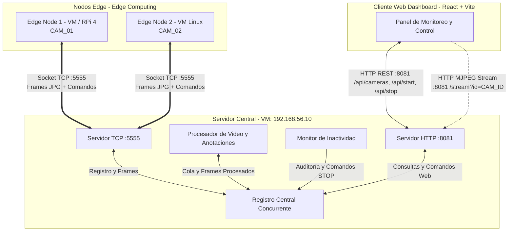
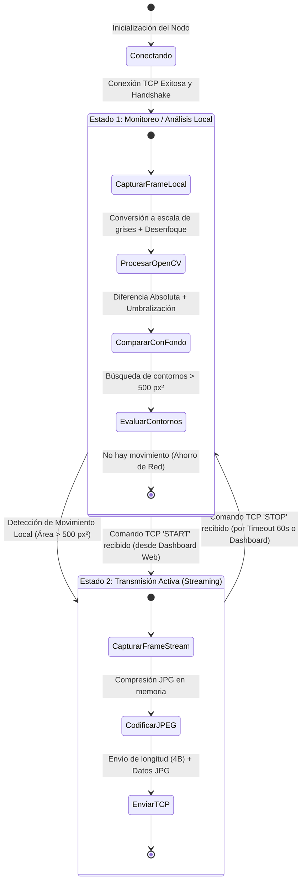

# Documentación Técnica del Sistema Distribuido de Videovigilancia Inteligente

**Cátedra:** Programación Distribuida y Tiempo Real (PDyTR)  
**Proyecto:** Sistema de Visión Computacional Distribuido y Monitoreo Inteligente en el Borde (Edge Computing)  
**Autores:** Nicolas Ricciardi — Fabrizio Torrico  
**Facultad de Informática, Universidad Nacional de La Plata (UNLP)** — Agosto 2026  

---

## 1. Funcionamiento General del Sistema

### 1.1. Propósito y Paradigma de Edge Computing
El sistema implementa una arquitectura distribuida de videovigilancia orientada a la **optimización del uso de ancho de banda en la red y del procesamiento central**, dando cumplimiento a los requerimientos del trabajo final de la cátedra de Programación Distribuida y Tiempo Real (PDyTR).

En concordancia con las definiciones metodológicas fijadas en las reuniones de seguimiento de la bitácora, se mantiene estricta consistencia en la terminología empleada: los términos *"Edge"* y *"Nodo de Borde"* representan conceptualmente el cómputo en el extremo de la red (implementado tanto sobre hardware físico real **Raspberry Pi 4B** como sobre máquinas virtuales Linux), mientras que *"Central Server"* y *"Back End"* corresponden al servidor centralizador.

En los esquemas convencionales de CCTV, todas las cámaras transmiten de forma ininterrumpida flujos de video completos hacia un servidor central, lo que satura los canales de comunicación y genera cuellos de botella de procesamiento. Para mitigar esta problemática, el presente proyecto aplica el paradigma de **Edge Computing (Computación en el Borde)**:

1. **Definición de Video "de Interés":** Siguiendo el alcance delimitado por la cátedra, se define video de interés estrictamente como **video con identificación de movimiento**. Los nodos de borde transmiten hacia el servidor central *únicamente* cuando se discrimina movimiento local en la escena vigilada.
2. **Procesamiento en el Borde:** Cada nodo de borde analiza localmente las imágenes capturadas utilizando técnicas de visión por computadora livianas implementadas con OpenCV.
3. **Silencio de Red (Ahorro de Recursos):** Mientras no se registre actividad en la escena, los nodos no transmiten video por la red, permaneciendo en estado de análisis local silencioso.
4. **Transmisión Conducida por Eventos:** Al detectarse movimiento relevante (o ante la petición explícita de un operador desde el cliente web), el nodo conmuta a modo de transmisión activa y envía los fotogramas comprimidos mediante un socket TCP hacia el Servidor Central.
5. **Procesamiento Central y Distribución:** El Servidor Central recibe los fotogramas, aplica algoritmos de sustracción y marcado para delimitar visualmente el movimiento con recuadros verdes y leyendas de alerta, gestiona temporizadores de inactividad para ordenar el retorno al modo silencioso cuando cesa la actividad, y expone los flujos de video mediante MJPEG y APIs REST hacia el Dashboard web.
6. **Topología Distribuida:** El sistema opera con al menos 2 nodos edge concurrentes (un nodo real sobre Raspberry Pi 4 y nodos simulados/virtualizados en PC mediante Vagrant).

---

### 1.2. Diagrama de Arquitectura Global



---

### 1.3. Componentes Principales

1. **Nodos de Borde (`edgeNode`)**:
   - Capturan video desde dispositivos de captura física (webcam USB vía Video4Linux2 en Linux) o archivos de video pregrabados para pruebas de simulación.
   - Ejecutan una máquina de estados con dos modalidades: **Monitoreo Local** (análisis silencioso) y **Streaming Activo** (transmisión de video).
   - Realizan detección de movimiento local en memoria mediante técnicas de visión artificial determinísticas con OpenCV.
   - Mantienen una conexión TCP bidireccional con el Servidor Central para el envío de fotogramas y la recepción de comandos remotos (`START` / `STOP`).

2. **Servidor Central (`centralServer`)**:
   - **Servidor TCP multihilo**: Recibe conexiones concurrentes en el puerto 5555, identifica cada cámara en el handshake inicial y encola los fotogramas entrantes en búferes acotados (`LinkedBlockingQueue` de capacidad 5) para eliminar la latencia acumulada (lag).
   - **Registro Central concurrente**: Estructura de datos compartida y segura para hilos (`ConcurrentHashMap`) que mantiene el estado en tiempo real de cada cámara (dirección IP, último fotograma procesado, canal de comandos, estampa de tiempo del último fotograma y estampa de tiempo del último movimiento).
   - **Procesador de Fotogramas**: Módulo independiente que analiza los fotogramas recibidos, detecta las regiones en movimiento, dibuja cuadros delimitadores (*bounding boxes*) verdes y la leyenda `"MOVIMIENTO DETECTADO"`, y publica el fotograma procesado en el registro.
   - **Monitor de Inactividad**: Tarea periódica de supervisión (cada 10 segundos) que detecta cuándo una cámara activa deja de registrar movimiento durante más de 60 segundos, emitiendo automáticamente la orden TCP `STOP` para restablecer el modo silencioso de ahorro de red.
   - **Servidor Web HTTP**: Expone endpoints REST en el puerto 8081 para administración remota y un canal de transmisión de video continuo en formato MJPEG (`multipart/x-mixed-replace`) para visualización directa en navegadores.

3. **Cliente Web (`webClient`)**:
   - Panel de control interactivo en React + Vite que consulta periódicamente (polling cada 500 ms) el estado de las cámaras, visualiza las transmisiones de video en vivo y permite el encendido/apagado manual de los flujos de video.

---

### 1.4. Máquina de Estados de los Nodos Edge

Cada nodo de borde implementa una máquina de estados finita estrictamente excluyente con dos modos de funcionamiento (establecidos junto a la cátedra el 02/02/26):



- **Estado 1 (Monitoreo / Análisis Local)**:
  - El nodo captura fotogramas de la cámara a velocidad normal (30 FPS), pero **no emite tráfico de video hacia la red**.
  - Cada fotograma se convierte a escala de grises, se suaviza mediante un desenfoque gaussiano (kernel de 21x21) para filtrar ruido del sensor, y se compara contra el fotograma anterior mediante sustracción de fondo (diferencia absoluta `absdiff`).
  - La imagen resultante se binariza mediante un umbral fijo y se aplica una dilatación morfológica para consolidar áreas contiguas.
  - Se calculan los contornos de la imagen binarizada. Si el área del contorno mayor supera el umbral estipulado (500 píxeles cuadrados), el nodo determina que existe movimiento relevante y conmuta al **Estado 2**.
  - Si la escena permanece estática, el hilo descansa preventivamente para minimizar el uso de CPU.

- **Estado 2 (Transmisión Activa)**:
  - El nodo captura fotogramas, los comprime en formato JPEG y los transmite inmediatamente a través del socket TCP precedidos por su longitud en bytes (entero Big-Endian de 4 bytes).
  - El nodo permanece en este estado enviando video continuo hasta recibir el comando TCP `STOP` desde el servidor (ya sea porque transcurrió el tiempo de inactividad de 60 segundos sin movimiento o porque el operador lo solicitó desde el panel web).
  - Al recibir `STOP`, el nodo vuelve al **Estado 1** y reinicia su fotograma de referencia local para prevenir detecciones espurias.

**Justificación del Algoritmo en el Edge (Visión Clásica vs. YOLO):**  
Durante la fase de prototipado se evaluaron modelos de redes neuronales (YOLOv5 Nano) sobre la CPU de la Raspberry Pi 4B. Las mediciones mostraron una degradación crítica del rendimiento a ~5 FPS y un consumo excesivo de CPU/temperatura. Siguiendo las directivas docentes, se consolidó el algoritmo clásico determinístico con OpenCV (diferencia de fotogramas sucesivos, desenfoque gaussiano y análisis de contornos), lo cual asegura una tasa fluida y estable de **~30 FPS** con mínimo consumo computacional.

---

### 1.5. Protocolo de Comunicación de Red

1. **Handshake Inicial**:
   - Al establecer la conexión TCP en el puerto 5555, el Edge Node envía como primer mensaje una cadena UTF-8 con su identificador único (por ejemplo, `CAM_01`).
   - El Servidor Central asocia dicho socket a la identidad de la cámara y a su dirección IP de origen.

2. **Transmisión de Video en el Canal de Datos (Edge $\rightarrow$ Servidor)**:
   - Cada fotograma se envía como una trama compuesta por un encabezado de 4 bytes (entero de 32 bits Big-Endian / `writeInt`) que especifica la longitud exacta del búfer en bytes, seguido inmediatamente por el arreglo binario de la imagen comprimida en JPEG.

3. **Canal de Control Bidireccional sobre TCP (Servidor $\rightarrow$ Edge)**:
   - Conforme a lo acordado en la reunión del 08/04/26, se descartó el uso de servidores HTTP en el edge para simplificar el nodo y ahorrar recursos. A través del mismo socket TCP ya establecido, el Servidor Central envía cadenas de comando UTF-8:
     - `START`: Ordena al nodo de borde ingresar al Estado 2 (Streaming Activo).
     - `STOP`: Ordena al nodo de borde regresar al Estado 1 (Monitoreo Local silencioso).

4. **Interfaz HTTP / REST y Transmisión MJPEG (Servidor $\leftrightarrow$ Cliente Web)**:
   - `GET /api/cameras`: Retorna la lista en formato JSON de todas las cámaras registradas, incluyendo su identificador, dirección IP y estado booleano de transmisión.
   - `GET /api/start?id=CAM_ID`: Solicita al servidor enviar el comando `START` a la cámara especificada.
   - `GET /api/stop?id=CAM_ID`: Solicita al servidor enviar el comando `STOP` a la cámara especificada.
   - `GET /stream?id=CAM_ID`: Canal de streaming continuo que utiliza el estándar MIME `multipart/x-mixed-replace; boundary=--BoundaryString` para enviar la secuencia de fotogramas procesados directamente hacia elementos visuales `` del navegador web.

---

## 2. Estrategia de Virtualización y Aprovisionamiento con Vagrant

### 2.1. Arquitectura de Red y Virtualización
Para garantizar el aislamiento de procesos y total reproducibilidad en la evaluación del sistema (según lo conversado en la bitácora respecto a no utilizar Docker sino máquinas virtuales completas por razones académicas y técnicas), la solución se virtualiza utilizando **Vagrant** junto con el hipervisor **Oracle VirtualBox**.

La infraestructura virtual se compone de tres máquinas virtuales conectadas a través de una **Red Privada (Host-Only Network)** bajo el segmento `192.168.56.0/24`:

| Máquina Virtual | Hostname | IP Privada | Puertos / Servicios | Recursos Asignados |
| :--- | :--- | :--- | :--- | :--- |
| **`central_server`** | `centralserver` | `192.168.56.10` | TCP `5555` (Video/Comandos)<br>HTTP `8081` (Redirigido a Host: `8081`) | 1 CPU, 1024 MB RAM |
| **`edge_node_1`** | `edgenode1` | `192.168.56.20` | Cliente TCP hacia `192.168.56.10:5555`<br>Controladores USB 2.0/3.0 activados | 1 CPU, 1024 MB RAM |
| **`edge_node_2`** | `edgenode2` | `192.168.56.21` | Cliente TCP hacia `192.168.56.10:5555`<br>Controladores USB 2.0/3.0 activados | 1 CPU, 1024 MB RAM |

---

### 2.2. Aprovisionamiento vs. Despliegue en Producción

> [!NOTE]
> **Nota Técnica sobre el Modelo de Entrega y Aprovisionamiento (Reunión del 08/04/26)**  
> En la configuración de Vagrant de este proyecto, el directorio del repositorio en la máquina anfitriona se monta automáticamente en el punto `/vagrant` de cada máquina virtual mediante carpetas compartidas.  
>  
> Durante la etapa de **aprovisionamiento (`provision shell`)**, se actualizan los repositorios del sistema operativo base (Ubuntu 22.04 LTS) y se instalan de manera automatizada las dependencias de software necesarias (OpenJDK 21, Apache Maven y utilidades de video). Inmediatamente a continuación, se ingresa a la carpeta compartida correspondiente (`/vagrant/centralServer` o `/vagrant/edgeNode`) y se ejecuta la compilación del código fuente (`mvn clean compile`), generando asimismo los scripts ejecutables de inicio (`start_central.sh` y `start_edge.sh`).  
>  
> **Aclaración de Diseño:** Se deja constancia de que compilar el código fuente directamente en la etapa de aprovisionamiento de las máquinas virtuales no constituye un proceso de despliegue productivo estándar (donde se generarían artefactos inmutables precompilados, imágenes de contenedor o paquetes Debian versionados). Para los fines de esta entrega académica, este mecanismo garantiza máxima **transparencia, reproducibilidad y verificación directa** de la compilación y ejecución del software sin necesidad de adjuntar binarios pesados en el repositorio de control de versiones.

---

## 3. Documentación del `Vagrantfile` y Dependencias

El archivo de configuración principal de la infraestructura es el [Vagrantfile](file:///c:/Users/NICOLAS/Desktop/2026/Facultad/pdytr/tp-pdytr/Vagrantfile). A continuación se documentan sus secciones y las dependencias explícitas de cada máquina virtual:

### 3.1. Configuración Base Global
- **Box Base**: Se utiliza la imagen oficial `ubuntu/jammy64` (Ubuntu Server 22.04 LTS de 64 bits), que proporciona un entorno Linux estándar, homogéneo y compatible con los paquetes de Java 21 y herramientas de captura multimedia.

### 3.2. Sección del Servidor Central (`central_server`)
- **Identificación y Red**: Asigna el nombre de host `centralserver` y la dirección IP estática `192.168.56.10` en la red privada.
- **Redirección de Puertos (Port Forwarding)**: Redirige el puerto huésped `8081` hacia el puerto anfitrión `8081`, permitiendo que el cliente web (dashboard en React) que corre en la máquina anfitriona pueda comunicarse con el servidor HTTP del Servidor Central.
- **Recursos de Hardware**: 1 núcleo de procesador y 1024 MB de memoria RAM.
- **Aprovisionamiento y Dependencias Instaladas**:
  - `openjdk-21-jdk`: Kit de desarrollo de Java versión 21 para compilar y ejecutar la aplicación.
  - `maven`: Herramienta de gestión y construcción de proyectos Java.
  - **Compilación del Código**: Se posiciona en `/vagrant/centralServer` y ejecuta la compilación del código fuente (`mvn clean compile`).
  - **Script de Inicio**: Genera `/home/vagrant/start_central.sh`, configurado para ejecutar la clase principal del servidor central mediante Maven.

### 3.3. Secciones de los Nodos de Borde (`edge_node_1` y `edge_node_2`)
- **Identificación y Red**: Asigna las direcciones IP estáticas `192.168.56.20` y `192.168.56.21` respectivamente.
- **Soporte de Hardware para Dispositivos USB**: Habilita en la configuración de VirtualBox los controladores USB (`--usb on`, `--usbehci on`, `--usbxhci on`), lo que permite realizar el pasaje directo (*passthrough*) de cámaras web USB físicas desde la máquina anfitriona hacia las máquinas virtuales.
- **Recursos de Hardware**: 1 núcleo de procesador y 1024 MB de memoria RAM por cada nodo.
- **Aprovisionamiento y Dependencias Instaladas**:
  - `openjdk-21-jdk`: Entorno de ejecución y compilación de Java 21.
  - `maven`: Gestor de construcción del proyecto.
  - `v4l-utils`: Utilidades del subsistema Video4Linux2 para detección, diagnóstico y configuración de dispositivos de captura de video en Linux.
  - **Compilación del Código**: Se posiciona en `/vagrant/edgeNode` y compila el código fuente del nodo de borde (`mvn clean compile`).
  - **Script de Inicio Parametrizado**: Genera `/home/vagrant/start_edge.sh`, el cual admite como parámetro opcional la fuente de video a utilizar (índice numérico de cámara `0`, `1`, o la ruta a un archivo de video para simulación), conectándose automáticamente a la IP del Servidor Central (`192.168.56.10`).

---

## 4. Virtualización y Módulos del Nodo de Borde (`edgeNode`)

### 4.1. Fuentes que Corren en los Edges
Los archivos de código fuente correspondientes al nodo de borde se encuentran en el paquete `org.alumnosinfo.tpdistribuido` dentro de la carpeta [edgeNode](file:///c:/Users/NICOLAS/Desktop/2026/Facultad/pdytr/tp-pdytr/edgeNode):

- **[EdgeNode.java](file:///c:/Users/NICOLAS/Desktop/2026/Facultad/pdytr/tp-pdytr/edgeNode/src/main/java/org/alumnosinfo/tpdistribuido/EdgeNode.java)**:  
  Es la clase principal y orquestador del nodo de borde. Se encarga de cargar las librerías nativas de OpenCV en el sistema (`nu.pattern.OpenCV.loadLocally()`), procesar los parámetros de ejecución (IP del servidor central, identificador de la cámara y fuente de video), coordinar los intentos de conexión y reconexión ante caídas de red, calcular la tasa de fotogramas por segundo (FPS) y gobernar el bucle de captura según el estado actual del nodo.

- **[EdgeStateManager.java](file:///c:/Users/NICOLAS/Desktop/2026/Facultad/pdytr/tp-pdytr/edgeNode/src/main/java/org/alumnosinfo/tpdistribuido/EdgeStateManager.java)**:  
  Modela el estado operativo del nodo de borde de forma segura para hilos mediante variables marcadas con `volatile` (`streamingMode` y `resetPrevGray`), asegurando sincronización inmediata entre el hilo de comandos TCP y el hilo de captura de video.

- **[MotionDetector.java](file:///c:/Users/NICOLAS/Desktop/2026/Facultad/pdytr/tp-pdytr/edgeNode/src/main/java/org/alumnosinfo/tpdistribuido/MotionDetector.java)**:  
  Implementa el algoritmo de detección de movimiento local en el borde mediante OpenCV. Aplica transformación a escala de grises, filtrado de desenfoque gaussiano de 21x21 para reducción de ruido, sustracción absoluta de fondo (`absdiff`) respecto al fotograma anterior, binarización por umbral y dilatación morfológica. Analiza los contornos geométricos resultantes y confirma la detección si el área supera los 500 píxeles cuadrados.

- **[StreamClient.java](file:///c:/Users/NICOLAS/Desktop/2026/Facultad/pdytr/tp-pdytr/edgeNode/src/main/java/org/alumnosinfo/tpdistribuido/StreamClient.java)**:  
  Gestiona la conexión por socket TCP con el Servidor Central. Al conectarse, realiza el apretón de manos transmitiendo el identificador del nodo. Mantiene un hilo receptor que escucha comandos entrantes (`START` para activar la transmisión y `STOP` para regresar a análisis local). En el modo de transmisión, comprime los fotogramas en formato JPEG y los envía con enmarcado de longitud de 4 bytes en bloques sincronizados.

- **[VideoSource.java](file:///c:/Users/NICOLAS/Desktop/2026/Facultad/pdytr/tp-pdytr/edgeNode/src/main/java/org/alumnosinfo/tpdistribuido/VideoSource.java)**:  
  Capa de abstracción para la captura de video. Soporta tanto dispositivos físicos (mediante el backend V4L2 en Linux o controladores del sistema en Windows) como archivos de video pregrabados (`.mp4`, `.avi`). En el caso de archivos de video, implementa un mecanismo de rebobinado automático al alcanzar el final de la pista para posibilitar simulaciones continuas e ininterrumpidas.

- **[pom.xml](file:///c:/Users/NICOLAS/Desktop/2026/Facultad/pdytr/tp-pdytr/edgeNode/pom.xml)**:  
  Archivo de configuración de dependencias de Maven para el nodo de borde. Declara la dependencia de OpenCV empaquetada (`org.openpnp:opencv:4.9.0-0`), librerías de registro SLF4J y el plugin `maven-shade-plugin` para empaquetado autónomo.

- **[edgenode.service](file:///c:/Users/NICOLAS/Desktop/2026/Facultad/pdytr/tp-pdytr/edgeNode/edgenode.service)**:  
  Unidad de servicio para **systemd**, diseñada para despliegues en dispositivos físicos independientes (como Raspberry Pi OS), permitiendo que el nodo de borde se inicie automáticamente tras el arranque del sistema.

---

### 4.2. Instalación y Formas de Ejecución en el Edge

1. **Aprovisionamiento Automatizado**:  
   Al ejecutar `vagrant up`, la máquina virtual del edge instala Java 21, Maven y utilidades de video, compila el código fuente ubicado en `/vagrant/edgeNode` y genera el script de inicio en `/home/vagrant/start_edge.sh`.

2. **Opciones de Ejecución dentro de la Máquina Virtual**:
   - **Con Cámara Física USB**:  
     Habiendo conectado y capturado la cámara desde el menú de dispositivos USB de VirtualBox, se ejecuta indicando el índice de la cámara:
     ```bash
     vagrant ssh edge_node_1
     ./start_edge.sh 0
     ```
   - **Con Archivo de Video Simulado**:  
     Para simular un flujo continuo con movimiento sin depender de cámaras físicas adicionales:
     ```bash
     vagrant ssh edge_node_1
     ./start_edge.sh /vagrant/videos/prueba.mp4
     ```

---

## 5. Virtualización y Módulos del Servidor Central (`centralServer`)

### 5.1. Fuentes que Corren en el Servidor
Los archivos de código fuente correspondientes al Servidor Central se encuentran en el paquete `org.alumnosinfo.tpdistribuido` dentro de la carpeta [centralServer](file:///c:/Users/NICOLAS/Desktop/2026/Facultad/pdytr/tp-pdytr/centralServer):

- **[CentralServer.java](file:///c:/Users/NICOLAS/Desktop/2026/Facultad/pdytr/tp-pdytr/centralServer/src/main/java/org/alumnosinfo/tpdistribuido/CentralServer.java)**:  
  Punto de entrada del Servidor Central. Carga las librerías nativas de OpenCV, crea la instancia compartida del registro de cámaras, inicia el monitor de inactividad, levanta el servidor web HTTP en el puerto 8081 y pone en funcionamiento el servidor TCP en el puerto 5555.

- **[CameraRegistry.java](file:///c:/Users/NICOLAS/Desktop/2026/Facultad/pdytr/tp-pdytr/centralServer/src/main/java/org/alumnosinfo/tpdistribuido/CameraRegistry.java)**:  
  Estructura central de almacenamiento en memoria protegida contra concurrencia (`ConcurrentHashMap`). Mantiene la correspondencia entre los identificadores de cámaras, sus direcciones IP, sus flujos de salida para envío de comandos, los últimos fotogramas procesados y las marcas temporales de recepción y detección de movimiento.

- **[TcpServer.java](file:///c:/Users/NICOLAS/Desktop/2026/Facultad/pdytr/tp-pdytr/centralServer/src/main/java/org/alumnosinfo/tpdistribuido/TcpServer.java)** y **[CameraSession.java](file:///c:/Users/NICOLAS/Desktop/2026/Facultad/pdytr/tp-pdytr/centralServer/src/main/java/org/alumnosinfo/tpdistribuido/CameraSession.java)**:  
  Implementan el servidor de sockets TCP multihilo. Por cada nodo que se conecta, se instancia un hilo de sesión que registra la cámara, crea una cola bloqueante acotada de fotogramas (`LinkedBlockingQueue(5)`) y lanza un hilo procesador. El bucle de lectura recibe los fotogramas y descarta los más antiguos si la cola alcanza su capacidad máxima, evitando retrasos perceptibles en la visualización.

- **[FrameProcessor.java](file:///c:/Users/NICOLAS/Desktop/2026/Facultad/pdytr/tp-pdytr/centralServer/src/main/java/org/alumnosinfo/tpdistribuido/FrameProcessor.java)**:  
  Hilo de procesamiento de imagen asociado a cada cámara activa. Toma los fotogramas de la cola, realiza detección de movimiento por sustracción de imagen, dibuja rectángulos verdes sobre los contornos con movimiento superior al umbral, añade la leyenda en texto rojo `"MOVIMIENTO DETECTADO"`, actualiza la marca de tiempo de movimiento en el registro y codifica el fotograma anotado en JPEG para su posterior distribución.

- **[InactivityMonitor.java](file:///c:/Users/NICOLAS/Desktop/2026/Facultad/pdytr/tp-pdytr/centralServer/src/main/java/org/alumnosinfo/tpdistribuido/InactivityMonitor.java)**:  
  Servicio temporizado que revisa periódicamente (cada 10 segundos) todas las cámaras que se encuentran transmitiendo. Si una cámara supera el tiempo límite estipulado (60 segundos) sin registrar movimiento, envía de forma automática el comando TCP `STOP` hacia el nodo de borde para retornar al modo de monitoreo silencioso.

- **Servidor Web y Manejadores HTTP (`web/` y `web/handlers/`)**:
  - **[WebServer.java](file:///c:/Users/NICOLAS/Desktop/2026/Facultad/pdytr/tp-pdytr/centralServer/src/main/java/org/alumnosinfo/tpdistribuido/web/WebServer.java)**: Inicializa el servidor HTTP embebido en el puerto 8081 y registra las rutas de la API y del flujo de video.
  - **[BaseHttpHandler.java](file:///c:/Users/NICOLAS/Desktop/2026/Facultad/pdytr/tp-pdytr/centralServer/src/main/java/org/alumnosinfo/tpdistribuido/web/handlers/BaseHttpHandler.java)**: Manejador base que configura las cabeceras CORS para permitir peticiones desde aplicaciones web externas, resuelve solicitudes de tipo pre-flight `OPTIONS` y proporciona métodos auxiliares de respuesta JSON.
  - **[CamerasApiHandler.java](file:///c:/Users/NICOLAS/Desktop/2026/Facultad/pdytr/tp-pdytr/centralServer/src/main/java/org/alumnosinfo/tpdistribuido/web/handlers/CamerasApiHandler.java)**: Genera y envía la lista de cámaras registradas con su estado actual en formato JSON.
  - **[CommandApiHandler.java](file:///c:/Users/NICOLAS/Desktop/2026/Facultad/pdytr/tp-pdytr/centralServer/src/main/java/org/alumnosinfo/tpdistribuido/web/handlers/CommandApiHandler.java)**: Procesa las peticiones `/api/start` y `/api/stop` dirigidas a una cámara específica y retransmite los comandos correspondientes al nodo por TCP.
  - **[StreamHandler.java](file:///c:/Users/NICOLAS/Desktop/2026/Facultad/pdytr/tp-pdytr/centralServer/src/main/java/org/alumnosinfo/tpdistribuido/web/handlers/StreamHandler.java)**: Implementa la transmisión de video continuo en formato MJPEG mediante la cabecera `multipart/x-mixed-replace`, entregando los fotogramas anotados al navegador web.
  - **[CameraDto.java](file:///c:/Users/NICOLAS/Desktop/2026/Facultad/pdytr/tp-pdytr/centralServer/src/main/java/org/alumnosinfo/tpdistribuido/web/CameraDto.java)**: Objeto de transferencia de datos utilizado para estructurar las respuestas JSON del estado de las cámaras.

- **[pom.xml](file:///c:/Users/NICOLAS/Desktop/2026/Facultad/pdytr/tp-pdytr/centralServer/pom.xml)**:  
  Define la configuración de construcción con Java 21 y la dependencia de OpenCV para el procesamiento de imágenes del servidor.

---

### 5.2. Instalación y Ejecución en el Servidor Central

1. **Aprovisionamiento Automatizado**:  
   Al lanzar el entorno con `vagrant up`, se instalan Java 21 y Maven en la máquina virtual del servidor, se compila el código fuente de `/vagrant/centralServer` y se prepara el script `/home/vagrant/start_central.sh`.

2. **Ejecución dentro de la Máquina Virtual**:
   ```bash
   vagrant ssh central_server
   ./start_central.sh
   ```
   El servidor iniciará el receptor TCP en el puerto `5555` y la interfaz web en `http://localhost:8081`.

---

## 6. Integración con el Cliente Web Dashboard (`webClient`)

El panel de control interactivo está ubicado en la carpeta [webClient](file:///c:/Users/NICOLAS/Desktop/2026/Facultad/pdytr/tp-pdytr/webClient) y fue desarrollado con **React + Vite**:

- **Consulta Periódica de Estado**: Realiza sondeos HTTP (cada 500 ms) a la ruta `/api/cameras` para actualizar en tiempo real el listado de cámaras activas, sus direcciones IP y si se encuentran o no transmitiendo.
- **Visualización en Vivo**: Muestra la señal de video de cada cámara que se encuentra en transmisión activa consumiendo directamente el endpoint `/stream?id=CAM_ID`.
- **Control Remoto**: Incluye botones para forzar manualmente el inicio o la detención de la transmisión de cada cámara mediante las rutas `/api/start` y `/api/stop`.
- **Ejecución**: Se instala y ejecuta en la máquina anfitriona mediante:
  ```bash
  cd webClient
  npm install
  npm run dev
  ```
  Accediendo luego a través de un navegador web a `http://localhost:5173`.

---

## 7. Resumen Consolidado de Dependencias y Requisitos

| Componente | Software / Herramienta | Versión | Función en el Sistema |
| :--- | :--- | :--- | :--- |
| **Virtualización** | Vagrant | $\ge$ 2.3 | Definición y aprovisionamiento automatizado de las VMs |
| **Hipervisor** | Oracle VirtualBox | $\ge$ 6.1 / 7.0 | Ejecución de VMs y emulación de controladores USB |
| **Sistema Huésped** | Ubuntu Server | 22.04 LTS (Jammy) | Sistema operativo base en todas las máquinas virtuales |
| **Lenguaje** | OpenJDK | 21 | Compilación y ejecución de aplicaciones Java |
| **Construcción** | Apache Maven | $\ge$ 3.8 | Gestión de dependencias y ciclo de vida de compilación |
| **Visión Artificial** | OpenCV (`org.openpnp:opencv`) | 4.9.0-0 | Procesamiento de imágenes y algoritmos de detección |
| **Captura Linux** | `v4l-utils` / Video4Linux2 | Nativo | Control y captura de dispositivos de video en Linux |
| **Frontend Web** | React + Vite (Node.js) | Node $\ge$ 18 | Dashboard interactivo de usuario y visualización |

---

## 8. Guía de Verificación y Puesta en Marcha

### 8.1. Despliegue Automatizado con Vagrant (Recomendado)

1. **Levantar la Infraestructura Virtual (en la raíz del proyecto):**
   ```bash
   vagrant up
   ```
2. **Iniciar el Servidor Central (Terminal 1):**
   ```bash
   vagrant ssh central_server
   ./start_central.sh
   ```
3. **Iniciar el Edge Node 1 (Terminal 2):**
   ```bash
   vagrant ssh edge_node_1
   ./start_edge.sh 0
   ```
4. **Iniciar el Edge Node 2 (Terminal 3):**
   ```bash
   vagrant ssh edge_node_2
   ./start_edge.sh /vagrant/videos/prueba.mp4
   ```
5. **Iniciar el Dashboard Web en el Host (Terminal 4):**
   ```bash
   cd webClient
   npm install
   npm run dev
   ```
   Acceder a `http://localhost:5173`.

### 8.2. Ejecución Nativa en Host (Sin Virtualización)

1. **Servidor Central**:
   ```bash
   cd centralServer
   mvn exec:java -Dexec.mainClass="org.alumnosinfo.tpdistribuido.CentralServer"
   ```
2. **Edge Node 1**:
   ```bash
   cd edgeNode
   mvn exec:java -Dexec.mainClass="org.alumnosinfo.tpdistribuido.EdgeNode" -Dexec.args="localhost CAM_01 0"
   ```
3. **Edge Node 2**:
   ```bash
   cd edgeNode
   mvn exec:java -Dexec.mainClass="org.alumnosinfo.tpdistribuido.EdgeNode" -Dexec.args="localhost CAM_02 1"
   ```
4. **Web Client**:
   ```bash
   cd webClient
   npm run dev
   ```
